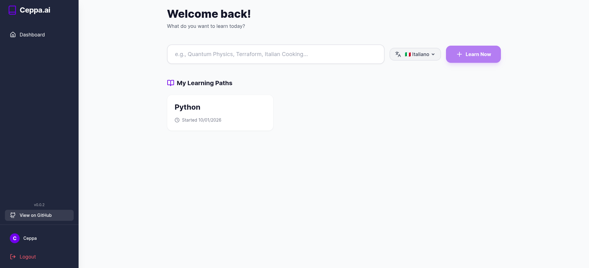
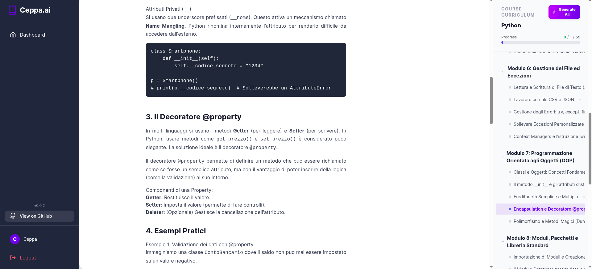
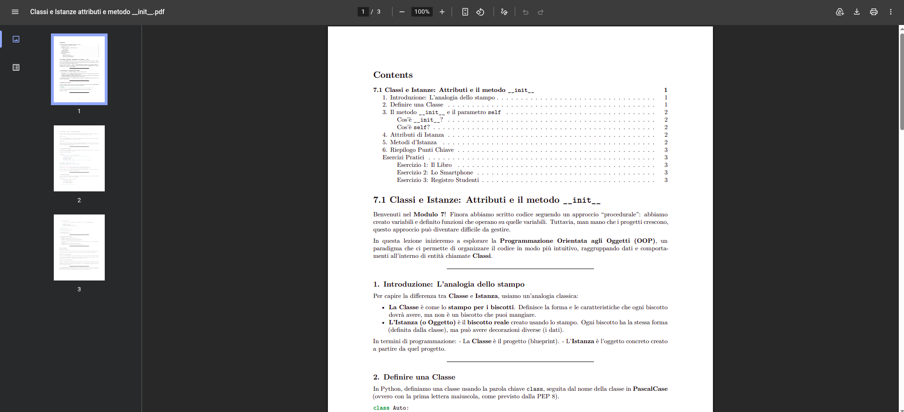

# Ceppa (o Autolearn perchè faceva più figo) - Generazione Intelligente di Corsi

⚠️ **DISCLAIMER**: Questo è un progetto **VIBE** (sperimentale) creato esclusivamente per testare le capacità di generazione automatica di contenuti con Antigravity. **NON è un progetto di produzione e devo dire che alcune parti tipo il dockerfile scritte cosi funzionano, certo, ma sono più che ottimizzabili.**

### Perchè è stato creato questo progetto?
Ceppa nasce dalla voglia di sperimentare quanto i modelli di linguaggio sono capaci di insegnare e strutturare piani di apprendimento guidati oltre che generare codice e immagini di brainrots.
Dopo 5 anni di apprendimento questi modelli sono in grado di generare contenuti di qualità accettabile per essere fruiti da utenti finali?
Sono in grado di restituire indietro agli utenti quello che "hanno appreso" in modo strutturato e coerente?
Ma soprattutto, qualcuno mi saprà spiegare perchè in python `(0.1 + 0.2) != 0.3`?

---
## Alcuni screenshoots





---

## 🏗️ Architettura del Progetto

**Ceppa** è una piattaforma web per la generazione automatica e intelligente di corsi online multilingui. Utilizza l'API di Google Generative AI (Gemini) per:

- ✨ Generare corsi completi da una descrizione
- 📖 Creare lezioni strutturate con indice e contenuti
- 📄 Esportare lezioni in PDF con formattazione professionale
- 🌍 Supporto multilingue (Italiano e Inglese)
- 📊 Tracciamento del progresso di completamento
- 🔐 Autenticazione sicura con JWT e bcrypt

---

## 🏗️ Architettura

```
Ceppa/
├── backend/              # FastAPI (Python 3.10)
│   ├── app/
│   │   ├── api/          # Endpoints API
│   │   ├── core/         # Config, DB, Security
│   │   ├── models/       # SQLAlchemy ORM
│   │   ├── schemas/      # Pydantic models
│   │   └── services/     # LLM & PDF generation
│   ├── Dockerfile
│   └── pyproject.toml    # Poetry dependencies
│
├── frontend/             # React 18 + Vite
│   ├── src/
│   │   ├── pages/        # Dashboard, CourseView, Auth
│   │   ├── components/   # Layout, ProtectedRoute
│   │   ├── context/      # AuthContext
│   │   └── api/          # API client
│   ├── Dockerfile
│   └── vite.config.js
│
├── data/                 # Persistent volumes
│   └── user_files/       # Generated PDFs
│
└── docker-compose.yml    # Orchestrazione
```

### Stack Tecnologico

**Backend:**
- FastAPI (async web framework)
- SQLAlchemy + PostgreSQL (database asincrono)
- Pydantic v2 (validation)
- Python-jose + bcrypt (JWT & password hashing)
- Pandoc + xelatex (PDF generation)
- Openai (LLM)

**Frontend:**
- React 18.3.1
- Vite 6.0.5 (build tool)
- TailwindCSS 3.4.17 (styling)
- React Router 6.28.0 (navigation)
- Framer Motion 11.15.0 (animations)
- Axios (HTTP client)

**DevOps:**
- Docker & Docker Compose
- PostgreSQL 15 (database)

---

## 🚀 Quick Start

### Prerequisiti
- Docker & Docker Compose
- API_KEY (generare da [Google AI Studio](https://aistudio.google.com)), che verranno usate con la libreria OpenAI per accedere ai modelli Gemini.

### Setup

1. **Clonare la repository**
   ```bash
   git clone https://github.com/piopy/ceppa.git
   cd ceppa
   ```

2. **Configurare le variabili d'ambiente**
   ```bash
   # Creare envs/develop.env e inserire:
   OPENAI_API_KEY=<<API_KEY>>
   OPENAI_BASE_URL=<<BASE_URL>>
   LLM_MODEL=<<MODEL_NAME>>
   DEFAULT_LANGUAGE=<<it/eng>>
   MAX_CONCURRENT_WORKERS=<<NUMBER>>
   POSTGRES_USER=<<USER>>
   POSTGRES_PASSWORD=<<PASSWORD>>
   POSTGRES_DB=<<DB_NAME>>
   DATABASE_URL=<<DATABASE_URL>>
   ```

   ```bash
   # Modificare il .env per scegliere le porte da esporre
   BACKEND_PORT=8000
   FRONTEND_PORT=5173
   DB_PORT=5432
   
   ENV_MODE=<<local/develop/deploy>>
   ```
   

3. **Avviare i container**
   ```bash
   docker-compose up -d
   ```

4. **Accedere all'applicazione**
   - Frontend: http://localhost:5173
   - API Docs: http://localhost:8000/docs
   - Database: localhost:5432

---

## 📖 Utilizzo

### 1. Registrazione / Login
- Creare un account con email e password (minimo 8 caratteri)
- Le password vengono hashate con bcrypt

### 2. Creare un Corso
```
1. Cliccare "Create New Course"
2. Inserire titolo e descrizione
3. Selezionare lingua (Italiano/Inglese/Custom)
4. Submit → l'AI genererà il corso
```

### 3. Generare Lezioni
```
1. Aprire un corso
2. Cliccare su una voce dell'indice o Generare tutte le lezioni dell'indice
3. La lezione viene generata e mostrata
4. Cliccare "Download PDF" per esportare, "Mark as Complete" per completare o "View Lesson" per aprire il PDF in un'altra tab
5. E' possibile rigenerare la lezione se necessario
```

### 4. Tracciamento Progresso
- Barra di progresso visuale con:
  - **Blu**: lezioni generate
  - **Verde**: lezioni lette (completate)
  - **Grigio**: lezioni non generate
- Contatore: "X/Y completate"

---

## 🔌 API Endpoints

### Autenticazione
```
POST   /auth/register          # Registrazione
POST   /auth/login             # Login
POST   /auth/refresh           # Refresh token
POST   /auth/logout            # Logout
```

### Corsi
```
POST   /courses                # Creare corso
GET    /courses                # Lista corsi utente
GET    /courses/{id}           # Dettagli corso
GET    /courses/{id}/lessons   # Progresso lezioni
DELETE /courses/{id}           # Eliminare corso
```

### Lezioni
```
POST   /lessons/{course_id}    # Generare lezione
GET    /lessons/{id}           # Recuperare lezione
GET    /lessons/{id}/pdf       # Scarica PDF
PUT    /lessons/{id}/complete  # Marca come completata
```

### Configurazione
```
GET    /config/languages       # Lingue disponibili
```


---

## 📋 Funzionalità Attuali

- ✅ Generazione automatica di corsi tramite AI
- ✅ Generazione di lezioni con contenuti strutturati
- ✅ Indice lezioni con scroll animation
- ✅ Esportazione PDF con fallback engine (xelatex → pdflatex)
- ✅ Autenticazione JWT sicura
- ✅ Tracciamento progresso lezioni
- ✅ Supporto multilingue (IT/EN)
- ✅ UI responsiva con TailwindCSS
- ✅ Animazioni fluide con Framer Motion

## 🚧 Limitazioni Conosciute

- ⚠️ **Progetto VIBE**: non è production-ready
- ⚠️ Nessuna gestione avanzata di errori di generazione
- ⚠️ PDF generati in memoria (no cache lungo termine)
- ⚠️ Nessuna paginazione nei corsi (scala male con molti corsi)
- ⚠️ No caching dei contenuti generati
- ⚠️ Nessun sistema di backup automatico

---

## 🔐 Sicurezza

- Password hashate con bcrypt
- JWT con HS256
- CORS configurato
- No hardcoded secrets (gestiti via ENV_MODE.env)
- Validation Pydantic v2 su tutti gli input

---

## 🐛 Troubleshooting

### "PDF generation failed"
- Assicurarsi che `data/user_files/` ha permessi 777
- Verificare che pandoc è disponibile nel container
- Controllare i log: `docker logs Ceppa-backend-1`

### "Invalid API key"
- Verificare che la chiave sia corretta
- Controllare che la chiave non è scaduta o si sono raggiunti i limiti di utilizzo in Google AI Studio

### "Connection refused" al database
- Aspettare che PostgreSQL sia avviato (5-10 secondi)
- Verificare `docker-compose ps`
- Controllare i log di postgres

---
## TIP per la generazione a costo zero
- Gemini offre il modello 3 flash gratuitamente con limiti di utilizzo giornalieri (20RPD);
- In alternativa, OpenRouter nel momento in cui sto scrivendo offre accesso gratuito a modelli come Deepseek e GPT-oss.


## 📝 Licenza

[MIT - Vedi Wikipedia per dettagli](https://it.wikipedia.org/wiki/Licenza_MIT)
